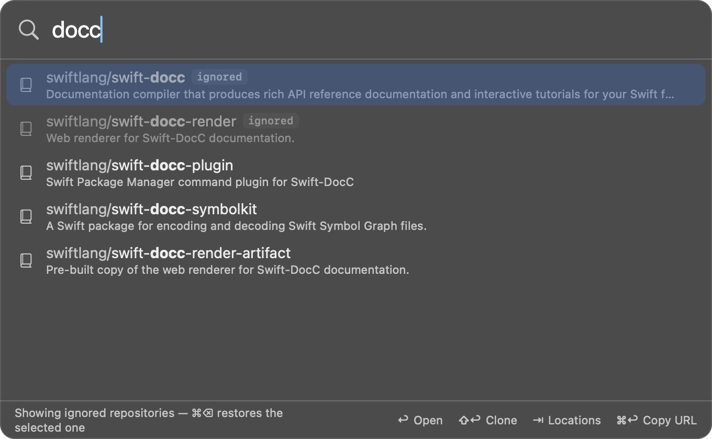
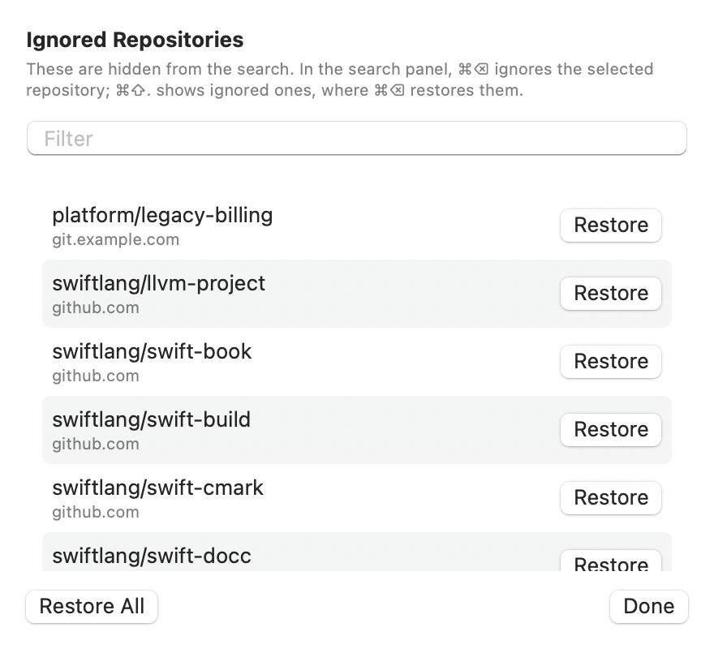

# Ignoring repositories

Large organizations have repositories you will never open. Ignoring one
removes it from the search without affecting anything on GitHub.

## Ignoring

Select the repository in the search panel and press `⌘⌫`. It disappears from
the list immediately, and the footer confirms it.

## Restoring

There are two ways to bring a repository back.

**From the search panel.** Press `⌘⇧.` — the same shortcut Finder uses to
show hidden files. Ignored repositories appear in the results, dimmed and
tagged `ignored`. Select one and press `⌘⌫` again to restore it.

The panel goes back to hiding them the next time you open it.

**From Settings.** In the **List** section, **Ignored repositories** shows
how many are hidden. **Manage…** opens the full list, with a **Restore**
button for each and **Restore All**. A filter field appears once the list is
long.

## Details

- The ignore list is per repository and per host: ignoring `acme/api` on
  github.com doesn't hide an `acme/api` on your enterprise host.
- It is stored in the [config file](configuration.md) under `ignored`, as
  `host/owner/name`.
- Ignored repositories are still fetched, so restoring one is instant.
