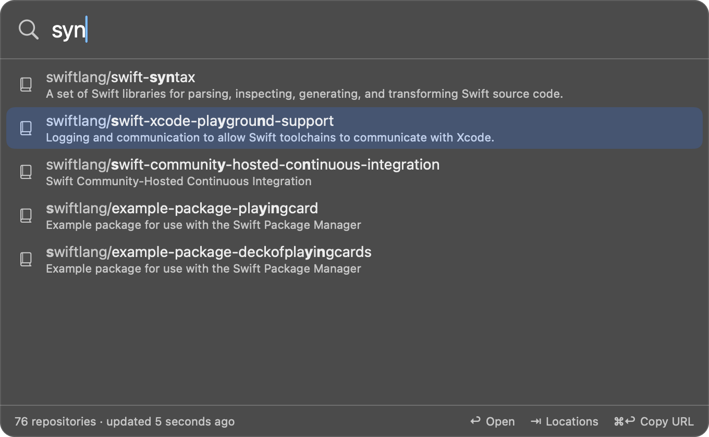

# Reponomi

A macOS menu bar app that takes you to a GitHub repository — or a specific
page inside it, or its clone on your disk — in a few keystrokes.

Press a global shortcut, type part of a name, press Return.

The name is a Devil Fruit that One Piece never had: the *Repo Repo no Mi*,
whose user can appear at any repository instantly. Say it "re-po-no-mi".

## What it does

- **Finds repositories fast.** Fuzzy search over every repository in the
  organizations and accounts you choose, ranked by how well the name matches
  and how often you open it. See [Searching](searching.md).
- **Goes straight to the page you want.** `api pr` opens the pull requests of
  the best match for `api`; `api a` its Actions. See [Locations](locations.md).
- **Opens the code on your disk.** `⇧↩` opens the local clone in your editor
  or terminal, cloning it first if you don't have it yet. See
  [Local clones](local-clones.md).
- **Works across GitHub hosts.** github.com and a company GitHub Enterprise
  side by side, each with its own sign-in. See [Accounts](accounts.md).
- **Stays out of the way.** Hide repositories you never need
  ([Ignoring](ignoring.md)); no account, no telemetry, nothing sent anywhere
  but GitHub ([Security](security.md)).

## The thirty-second tour

| Type | Press | Result |
| --- | --- | --- |
| `api` | `↩` | Opens the repository in your browser |
| `api pr` | `↩` | Opens its pull requests |
| `api` | `⇥` | Lists every place you can go in it |
| `api` | `⇧↩` | Opens the local clone (cloning it if needed) |
| `api` | `⌘↩` | Copies its URL |

New here? Start with [Getting started](getting-started.md).

## All pages

1. [Getting started](getting-started.md) — install, first launch, first search
2. [Searching](searching.md) — the panel, the keys, how results are ranked
3. [Locations](locations.md) — jumping to pull requests, issues, Actions and more
4. [Accounts](accounts.md) — signing in, organizations, GitHub Enterprise
5. [Local clones](local-clones.md) — working directories, cloning, editors and terminals
6. [Ignoring repositories](ignoring.md) — hiding and restoring
7. [Configuration](configuration.md) — every setting and the config file
8. [Security](security.md) — what the app protects and what it assumes
9. [Troubleshooting](troubleshooting.md) — common problems and fixes
