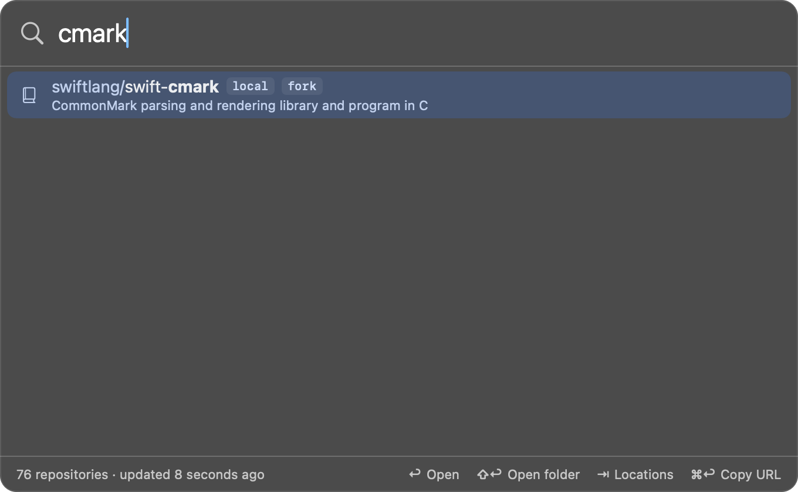
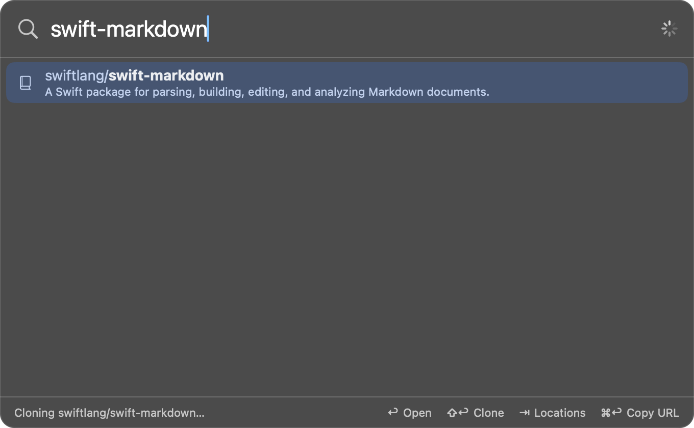

# Local clones

Besides opening a repository on GitHub, the app can open it on your disk —
in an editor, a terminal or Finder — and clone it first if you don't have it.

## Setting up

In Settings:

1. Give the account a **Working directory**, e.g. `~/Projects`. Each account
   has its own, so work and personal repositories can live apart.
2. Choose **Clone with** SSH or HTTPS, whichever you normally use with that
   host.
3. Under **Local folders**, pick what to **Open with**: Finder, an editor, or
   a terminal.

## Using it

- `⇧↩` on a repository opens its local clone.
- So does the `l` [location](locations.md): `api l` `↩`.



Repositories that are already on your disk are tagged `local`, and the
footer hint reads "Open folder". For the others it reads "Clone".

## Cloning

When there is no clone yet, the repository is cloned into

```
<working directory>/<repository name>
```

and then opened.



- The panel shows progress. You can dismiss it; the clone carries on and the
  folder opens when it finishes.
- The working directory is created if it doesn't exist.
- Cloning uses your own git setup: your SSH keys or credential helper. A
  clone that would have to ask for a password fails with git's message
  rather than waiting.
- If something that isn't a clone of the repository already sits at that
  path, nothing is touched and the footer says so. This is also what happens
  with two repositories of the same name under different owners.

## Which folders count as a clone

The app recognizes clones by their git remotes, not their folder names. It
looks in two places:

1. **Folders directly inside the working directory.** Any of them with a
   `.git` folder is a clone, whatever it is called.
2. **Folders one level down**, but only for repositories whose owner matches
   the parent folder's name. `~/Projects/acme/api` counts for `acme/api`.

Nothing deeper is searched, and hidden folders and symbolic links are
skipped.

A clone matches a repository when one of its remotes points at the same
`owner/name` — preferably on the same host, otherwise on any host, which
covers remotes that go through an SSH host alias. Clones directly in the
working directory always win over nested ones.

With working directory `~/Projects` and the repository `acme/api`:

```
~/Projects/
├── api/                  ✓ remote is acme/api
├── api-experiment/       ✓ also acme/api; the folder name is irrelevant
├── acme/
│   └── api/              ✓ nested under a folder named after the owner
├── work/
│   └── api/              ✗ parent folder is "work", not "acme"
├── clients/acme/api/     ✗ three levels deep
├── link-to-api -> …      ✗ symbolic link
└── .archive/api/         ✗ hidden folder
```

Worth knowing:

- **Forks.** A clone whose `origin` is your fork and whose `upstream` is the
  original counts as a local clone of both.
- **Worktrees and submodule checkouts** aren't recognized.
- **Different layout?** Point the account's working directory at the folder
  that directly contains its clones.

## Opening in an app

**Open with** lists the editors and terminals found on your Mac, plus Finder
and **Other…** for anything else. The folder is handed to that app the same
way as dragging it onto the app's icon.

## Running a command in a terminal

With **Terminal** or **iTerm** chosen, a **Run command** field appears. Enter
a command — `lazygit`, for example — and `⇧↩` will open a new terminal
window in the repository's folder and run it there, in your own shell with
your usual `PATH` and aliases. When the command exits you are left at a
prompt in the repository.

- **Terminal** needs no permission.
- **iTerm:** the first time, macOS asks whether Reponomi may control
  iTerm. Allow it. You can change this later in System Settings › Privacy &
  Security › Automation.
- Other terminals open the folder but can't be given a command.

The command runs inside whatever repository you opened. That is fine for
tools like `lazygit`; a command such as `make` or `npm install` would run
that repository's own code.
