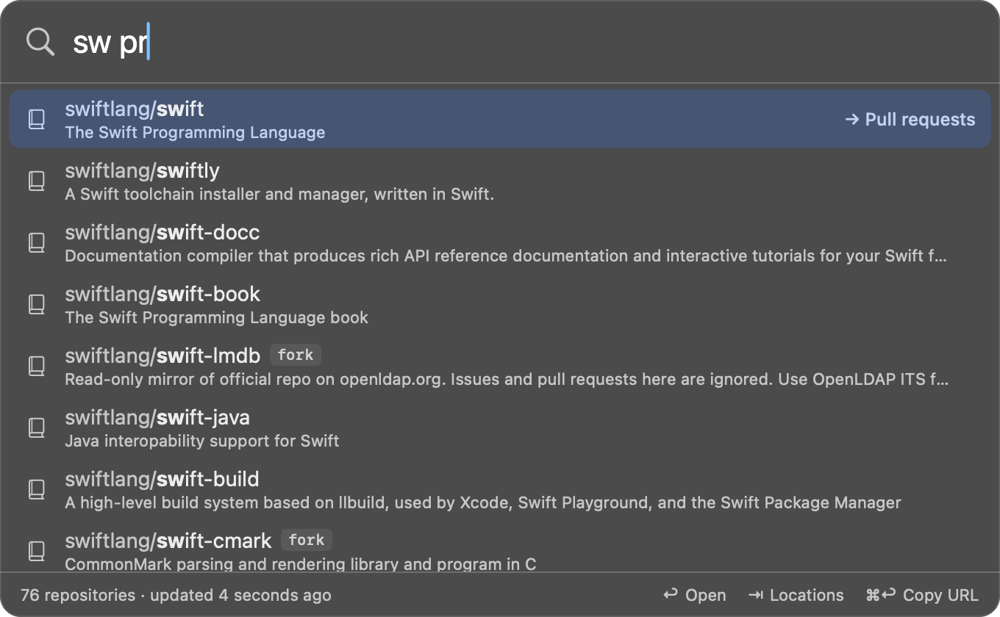

# Locations

A location is a place inside a repository: its pull requests, its Actions
runs, its settings. There are two ways to get to one.

## Inline: add a key after a space

Type the repository, a space, and a location key:



`sw pr` `↩` opens the pull requests of the selected repository. The
selected row shows where Return will go. Arrow keys still choose among the
repositories.

## From a list: press Tab

`⇥` locks the selected repository and lists every location. Type to filter,
`↩` to open, `esc` to go back to the repository search with your query
intact.

## Built-in locations

| Keys | Location | Opens |
| --- | --- | --- |
| `c`, `code`, `home` | Code | the repository's front page |
| `l`, `local`, `clone` | Local folder | the [clone on your disk](local-clones.md) |
| `p`, `pr`, `prs`, `pulls` | Pull requests | `/pulls` |
| `i`, `issues` | Issues | `/issues` |
| `a`, `ci` | Actions | `/actions` |
| `r`, `rel` | Releases | `/releases` |
| `b` | Branches | `/branches` |
| `co`, `log` | Commits | `/commits` |
| `t` | Tags | `/tags` |
| `s` | Settings | `/settings` |
| `w` | Wiki | `/wiki` |
| `d` | Discussions | `/discussions` |
| `pj` | Projects | `/projects` |
| `se`, `sec` | Security | `/security` |
| `in`, `pulse` | Insights | `/pulse` |
| `mp`, `my` | My pull requests | open pull requests you authored |
| `np`, `compare` | New pull request | `/compare` |
| `ni` | New issue | `/issues/new` |

## How a location is chosen from what you type

1. A key that matches exactly wins: `p` is always Pull requests.
2. Otherwise, a key that starts with what you typed: `pu` finds `pulls`.
3. Otherwise, the location names are searched the same fuzzy way as
   repositories: `sett` finds Settings, `disc` Discussions.

If nothing matches, the row says so and Return does nothing.

## Adding your own

Custom locations go in the [config file](configuration.md#custom-locations):

```json
"customLocations": [
  { "name": "Deployments", "path": "/deployments", "keys": ["dp"] },
  { "name": "Docs folder", "path": "/tree/{branch}/docs", "keys": ["docs"] }
]
```

- `path` is appended to the repository's URL.
- `{branch}` is replaced by the repository's default branch.
- `keys` are optional; without them the location is still found by name.
- Custom locations are listed and matched ahead of the built-in ones, so
  giving one the key `d` takes `d` over from Discussions.

Restart the app after editing the file.
